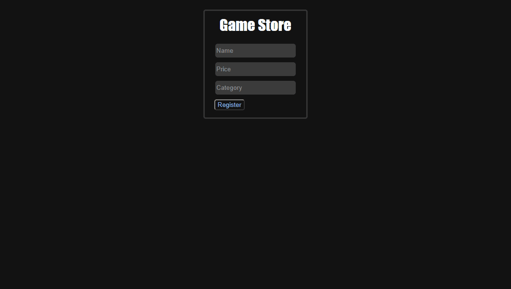
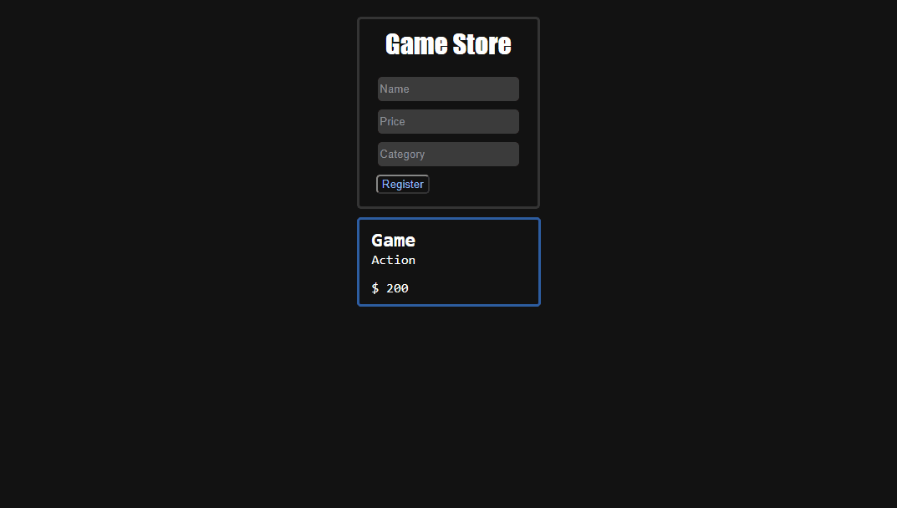

# CRUD with ReactJS, NodeJS and MySQL

## Create/Edit/Delete 

## Installing
### Client
1. `$ cd client`
2. `$ npm install`
3. `$ npm start`

### Server
1. Change your mySQL database data `server/index.js`
2. `$ cd server`
3. `$ npm install`
4. `$ npm start`

### Functionalities
+ Create games in the database
+ Read games in the database
+ Update games in the database
+ Delete games in the database
+ Click card to edit and delete

### Used Libraries

#### Front-end: 
`@material-ui`
`axios`

#### Back-end:
`express`
`mysql2`
`nodemon`
`cors`
